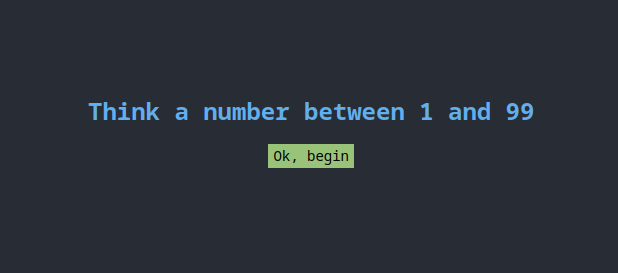
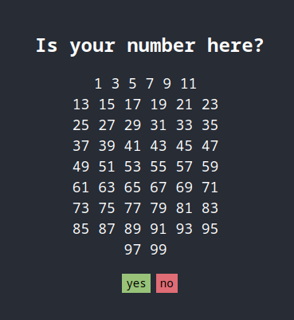
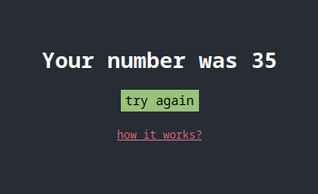

# 99 guess

This is a fun website that will guess a number you're thinking!
It is made with vanilla **JavaScript** and has a pleasant user interface.

[Click here to play](https://99-guess.glitch.me)

## Gallery

# License
This project is licensed under the terms of the MIT license.
The MIT License is a permissive license that is short and to the point. It lets people do anything they want with your code as long as they provide attribution back to you and don’t hold you liable.